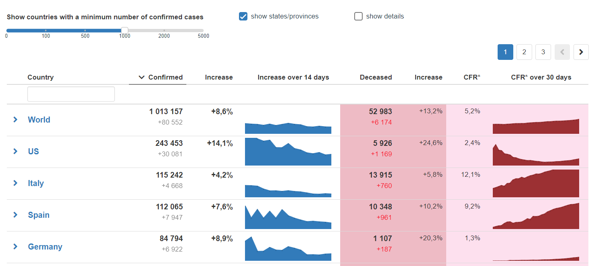
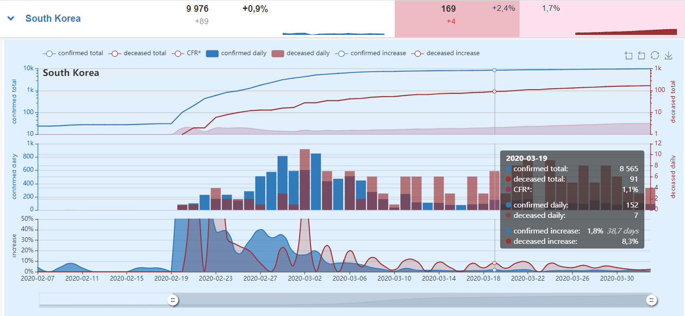

# SARS-CoV-2 Analysis

 

## Description

A quick analysis of coronavirus figures, in particular relative increases in confirmed changes, trendlines,
as well as relative CFR ratios (very crudly approximated by a simple division of confirmed cases by deceased cases).

## Why another one?

<strong>We need relative numbers!</strong> All countries have different testing capacities and often also different rules as what counts as confirmed case or coronavirus-related fatality. Thus, relative ration and relative increases in numbers can be more informative.

I haven't seen calculations and simple visualizations of relative numbers. That is why I did this quick weekend project.
This is my first [vue.js](https://vuejs.org/) project, so it might not be done completely optimally.

## OK, I am convinced, let me see it!

Sure, no problem. Here you go: [Live version](https://alexriss.github.io/SARS-CoV-2-Analysis/)

## Obligatory screenshot

 

## Is it beta?

Of course! Even rather alpha. It is a weekend project and I just work on this in my free time. Please double check all numbers and graphs.

## Data source

The data is automatically downloaded from [Johns Hopkins University](https://github.com/CSSEGISandData/COVID-19) and parsed in-situ.

## Todo

* parse US states
* R0 estimation
* improve mobile experience
* add horizontal gridlines for sparklines, at positions indicating 3-day, 5-day, 19-day doublings
* improve tooltip position for sparklines, probably static position will be best
* calculate the CFR based on confirmed cases n days ago (controlled via slider)
* save settings locally (vue.js localStorage)
